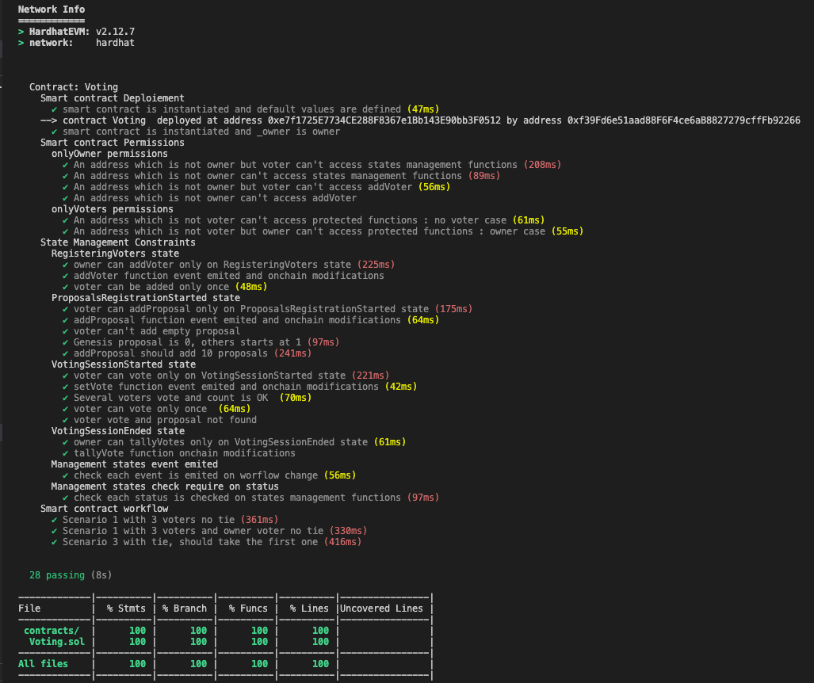

# Projet 2 - Système de Vote

## Sujet
Vous repartirez du smart contract proposé en correction 

Vous devez alors fournir les tests unitaires de votre smart contract Nous n’attendons pas une couverture à 100% du smart contract mais veillez à bien tester les différentes possibilités de retours (event, revert).

  
 

## Mise en place

- CI intégrée sur github pages
- Couverture de code 100% réalisée sur un projet hardhat.
  
Ce qui m'a permis d'ailleurs de déceller que j'avais oublié 4 test de require. Code Coverage 100%, line 100% mais Branch 92%. (bizare de ne pas avoir eu un code coverage <100%...)

Au vu de la structure des fonctions (modifier et require) j'ai commencé par verifier toutes les permissions et droits en testant tous les cas qui doivent échouer avant de tester le cas fonctionnel avec verification de l'emission de l'event et des modifications des variables associées

Tous les tests ont été mis dans un seul fichier comme demmandé. En vrai, j'aurai peut être découpé en Permissions / Droits / Workflow pour plus de lisibilité

 

# Tests effectués
## Deploiement du contrat
- Verification valeurs par défaut
- vérification owner propriétaire

## Verifications des permissions
    Dans cette partie, seules les restrictions sont testées. Les cas ou cela fonctionne seront traités dans les cas fonctionnels pour moins de code.

### Méthodes protégées par onlyOwner
- un voter non owner ne peut pas  accéder aux méthodes de management de state
- un non voter non owner ne peut pas accéder aux méthodes de management de state
- un voter non owner ne peut ajouter de voter
- un non voter non owner ne peut ajouter de voter
 

### Méthodes protégées par onlyVoters
- un non voter ne peut pas accéder aux méthodes protégées
- un non voter **MAIS owner** ne peut pas non plus accéder aux méthodes protégées

## Test des contraintes de status du workflow
###  status RegisteringVoters
- l'ajout d'un voter ne peut se faire que dans ce status
- verif fonctionement addVoter (Event et changement effectués)
- un voter ne peut etre ajouté qu'une fois

### Status ProposalsRegistrationStarted
- l'ajout d'une proposition ne peut se faire que dans ce status
- verif fonctionement addProposal (Event et changement effectués)
- une proposition ne peut etre vide
- les propositions commencent a 1, 0 étant GENESIS
  
### Status VotingSessionStarted
- le vote ne peut se faire que dans ce status
- verif fonctionement setVote avec un voteur (Event et changement effectués)
- verif fonctionement setVote avec deux voteurs
- un voter ne peut voter qu'une fois
- Evenement lorsque la proposition n'est pas trouvée
  
### Status  VotingSessionEnded
- l'ajout d'un voter ne peut se faire que dans ce status

### Emission des Evenements
- vérification de l'émission d'évènement à chaque changement d'état

### Verification des status des Evenements
- vérification d status courant dans les changements de status 
  
## test fonctionnels
- verification d'un scénario avec plusieurs voters ou l'owner n'est pas voter et verification du gagnant
- scénario similaire avec le owner voter
- scénario avec égalité sur un vote

# Annexe
## tests

## Gas Reporter

## Coverage
Mise en place du codeCoverage du fichier dans un projet Hardhat

